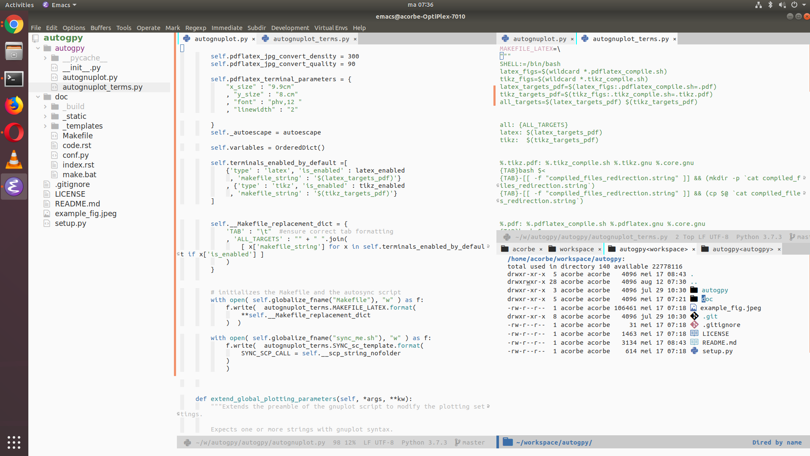

# my-emacs-configuration

This is my current emacs configuration, updated as it goes. I use emacs for nearly everything in my  work as a [reasearcher, which entails a lot of software development :).](http://corbetta.phys.tue.nl) 

Tested on emacs 26.2 (how to install latest emacs: [linux](http://ubuntuhandbook.org/index.php/2019/02/install-gnu-emacs-26-1-ubuntu-18-04-16-04-18-10/),  [macos](https://emacs.stackexchange.com/questions/37240/how-install-emacs-26-or-whatever-latest-ver-on-mac)).

## Installation

+ run `link_this_config.sh` or replace your `~/.emacs` file with the file in this repo (in this case, make sure your `~/.emacs.d` is empty). 
+ All the packages will install by themselves. :)
+ Finalize by:
    + <kbd>M-x all-the-icons-install-fonts</kbd>
    + <kbd>M-x company-tabnine-install-binary</kbd>
+ For elpy to work properly:
  + `pip install jedi rope autopep8 yapf black flake8`
`

## Comes with
+ IDE: treemacs, icons, centaur tabs (all enabled by default in display-graphic)
+ default themes: gui/display-graphic: `doom-one`, terminal: `zenburn`
+ modeline: doom 
+ company, company-tabnine
+ swiper for anything + avy-posframe 
+ avy
+ Editing: autopair, undo-tree, highlight-parentheses
+ Python: elpy, ein, company enabled
+ CEDET support, cmake, cmake-font-lock
+ Latex: auctex, latex-preview-pane, gscholar-bibtex
+ Other modes: gnuplot-mode, yaml-mode, markdown-mode

## Some keybindings
+ <kbd>M-x</kbd>: `swiper-m-x`
+ <kbd>C-o</kbd>: `occur`
+ <kbd>f5</kbd>: `compile` 
+ <kbd>f7</kbd>/<kbd>C-f7</kbd>: `winner-undo`/`winner-redo`
+ <kbd>C-S-arrows</kbd>: resize window
+ <kbd>C-x t</kbd>: opens or moves to terminal
+ <kbd>M-'</kbd>: `avy-goto-char-2`
+ <kbd>f8</kbd>: `treemacs`
+ <kbd>S-f8</kbd>: `centaur-tabs`
+ <kbd>C-=</kbd>/<kbd>C-M-=</kbd>: `previous-multiframe-window` (cycles between both frames and windows)
+ more...

## Screenshots

